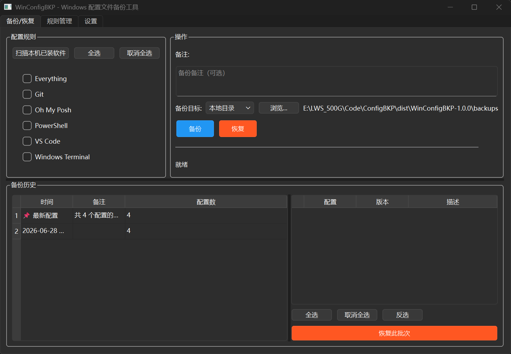

# WinConfigBKP

Windows 配置文件备份工具。自动扫描本机已装软件，一键备份/恢复 VS Code、PowerShell、Git、Windows Terminal、Everything 等常用软件的配置文件。

## 界面预览



## 功能

- **自动扫描** — 扫描本机已装软件，自动勾选匹配的配置规则，勾选的程序排在列表上方
- **一键备份/恢复** — 勾选软件 → 选择目标 → 点击备份/恢复；支持多选批量恢复
- **增量备份** — 只备份 SHA256 变化的文件，节省空间和时间
- **版本管理** — 按 session 分组展示备份历史，自动保留最近 N 个版本，超出自动清理
- **多种存储** — 本地目录 / ZIP 打包
- **文件占用处理** — 检测被锁文件，支持 MoveFileEx 重启时替换
- **JSONC 配置规则** — 可视化向导 + 源码双模式编辑，自由添加新软件的备份规则
- **定时备份** — 注册 Windows 计划任务每日自动备份（`--silent-backup` 静默模式）
- **会话聚合** — 同一次批处理备份的所有配置归为一个 session，方便批量恢复
- **便携式打包** — `--onedir` 打包，config/ 和 backups/ 跟随 exe 目录
- **UAC 自动提权** — 非管理员运行时自动请求提升权限
- **日志调试** — 设置 `WINCONFIGBKP_DEBUG=1` 输出详细运行日志

## 快速开始

### 环境要求

- Python 3.10+
- uv 或 pip

### 安装与运行

```powershell
# 1. 进入项目目录
cd E:\LWS_500G\Code\ConfigBKP

# 2. 创建虚拟环境并安装依赖
uv venv
uv pip install --python .\.venv\Scripts\python.exe -r requirements.txt

# 3. 激活虚拟环境
.\.venv\Scripts\activate

# 4. 运行
python main.py
```

首次运行会弹出 UAC 权限请求窗口，点击「是」以管理员身份运行。

### 打包为 EXE

```powershell
# 确保依赖已安装
.\.venv\Scripts\activate

# 执行打包
.\build.ps1
```

打包后的 exe 位于 `dist/WinConfigBKP-1.0.0/`，双击运行或放在 U 盘便携使用。

## 详细文档

项目文档位于 `doc/` 目录，分为代码文档和使用文档两部分：

| 文档 | 类型 | 内容 |
|------|------|------|
| `doc/代码文档/01-程序入口与权限.md` | 开发者 | main.py + cli.py：UAC 提权 + --silent-backup 静默模式 |
| `doc/代码文档/02-核心逻辑层.md` | 开发者 | config_parser / backup_engine / restore_engine / scanner |
| `doc/代码文档/03-存储后端.md` | 开发者 | base / local / zip_storage 接口与实现 |
| `doc/代码文档/04-界面层.md` | 开发者 | main_window / home_tab / config_tab / config_wizard / settings_tab |
| `doc/代码文档/05-工具层.md` | 开发者 | app_path / path_expander / file_hasher / time_util / file_locker |
| `doc/代码文档/07-数据模型.md` | 开发者 | BackupResult / BackupSession / BackupSummary 等数据类 |
| `doc/使用文档/06-配置文件格式与书写指南.md` | 用户 | JSONC 格式说明 + 手把手教你写配置规则 |
| `doc/使用文档/08-调试模式使用指南.md` | 用户 | 环境变量设置 / 日志场景 / 排查方法 |

## 内置配置规则

| 规则 | 平台 | 备份路径 |
|------|------|----------|
| VS Code | windows | `%APPDATA%\Code\User\*.json` |
| PowerShell | windows | `%USERPROFILE%\Documents\PowerShell\*.ps1` |
| Git | cross-platform | `%USERPROFILE%\.gitconfig` |
| Windows Terminal | windows | `%LOCALAPPDATA%\Packages\...\settings.json` |
| Oh My Posh | windows | `%USERPROFILE%\.oh-my-posh.omp.json` |
| Everything | windows | `%APPDATA%\Everything\*.ini` |

用户自定义规则放在 `config/user/`，程序会自动加载。

### 规则格式

```jsonc
{
  "name": "软件名称",                    // 显示名称
  "platform": "windows",                // windows | macos | linux | cross-platform
  "paths": ["%APPDATA%\\...\\file"],    // 备份路径，支持 %xxx% 环境变量
  "parser_fields": {                     // 自动生成备份摘要
    "editor.fontSize": "字号"
  },
  "strategy": {
    "type": "incremental",              // full | incremental
    "max_versions": 10                  // 最大保留版本数
  }
}
```

## 项目结构

```
WinConfigBKP/
├── main.py                 # 入口（argparse + UAC 提权）
├── requirements.txt        # 依赖清单
├── build.ps1               # PyInstaller 打包脚本
├── config/
│   ├── builtin/            # 内置配置规则 (.jsonc)
│   └── user/               # 用户自定义规则
├── src/
│   ├── cli.py              # --silent-backup 静默备份模式
│   ├── gui/
│   │   ├── main_window.py  #   3-Tab 主窗口
│   │   ├── home_tab.py     #   备份/恢复面板
│   │   ├── config_tab.py   #   规则管理（源码+向导双模式）
│   │   ├── config_wizard.py#   4 步向导式配置编辑器
│   │   └── settings_tab.py #   设置（定时任务 + 版本策略）
│   ├── core/
│   │   ├── backup_engine.py    # 异步备份引擎（BatchBackupWorker）
│   │   ├── restore_engine.py   # 异步恢复引擎（路径遍历保护）
│   │   ├── config_parser.py    # JSONC 解析 + 字段提取
│   │   ├── manifest_manager.py # 增量备份清单（SHA256）
│   │   └── scanner.py          # 本机软件扫描
│   ├── storage/
│   │   ├── base.py         #   抽象接口 + 数据模型
│   │   ├── local.py        #   本地目录存储
│   │   └── zip_storage.py  #   ZIP 打包存储（安全提取）
│   └── utils/
│       ├── app_path.py     #   便携式路径解析
│       ├── path_expander.py#   环境变量展开
│       ├── file_hasher.py  #   SHA256 哈希
│       ├── time_util.py    #   UTC→本地时间转换
│       ├── file_locker.py  #   文件占用检测 + MoveFileEx
│       └── _utils.py       #   共享工具函数
├── backups/                # 默认备份输出目录（自动创建）
├── doc/                    # 文档
│   ├── README.md           #   入口
│   ├── 代码文档/           #   开发者文档
│   └── 使用文档/           #   用户文档
└── todo/                   # 开发计划
```

## 技术栈

- Python 3.14 + PySide6
- JSONC 配置（json5 解析）
- QThreadPool + QRunnable 异步
- QTimer 驱动批次恢复
- Windows Task Scheduler（计划任务）
- PyInstaller --onedir 便携打包
